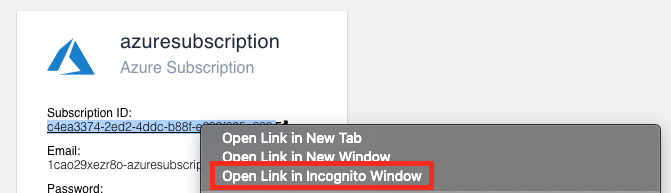

# Terraform Foundations on Azure

## 👋 Introduction
Welcome to Terraform Foundations on Azure. Follow the instructions on this page to complete all your lab assignments. You may use the navigation menu on the left to jump to a particular lab exercise.

## 👩🏾‍🔬 Your Lab Environment
Your lab environment is running on the <a href="https://instruqt.com" target="_blank">Instruqt</a> platform. Instruqt provides sandbox cloud environments where you can experiment and learn how to use HashiCorp tools like Terraform. You have four tabs in your learning environment:

* **Instructions** - This is the tab you're on right now. All your lab instructions are contained on this page. You should return to this tab whenver you need to review the instructions or move on to a new lab exercise.
* **Text Editor** - This tab contains a simple programmer's text editor. Use the file navigation menu on the left side of the editor to browse to files that you wish to edit.
* **Shell** - This is the bash shell for your Ubuntu 18.04 workstation. We've pre-installed a bunch of popular devops tools such as terraform, git, docker, and the `az` Azure CLI tool.
* **Azure Portal** - This tab contains a link and credentials for your Azure sandbox subscription.

NOTE: Use an incognito window when you log onto the Azure portal. You can do this by right-clicking the link on the Azure Portal page and selecting "Open in Incognito Mode" or "Open in Private Mode". Using an incognito/private window for all your lab exercises will ensure that you don't accidentally log on with your company or personal account.

## Lab 1: Terraform Basics

## Lab 2: The Azure Provider

## Lab 3: Build a Resource Group

## Lab 4: Add a Virtual Network

## Lab 5: Create a Subnet

## Appendix A: The Answers