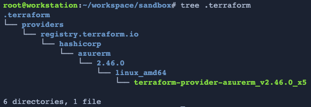
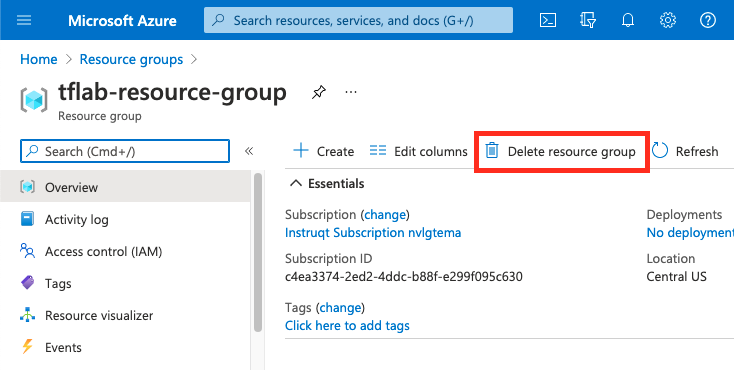

# Terraform Foundations on Azure

## 👋 Introduction
Welcome to Terraform Foundations on Azure. This is a hands-on workshop that will teach you how to build Azure infrastructure using code. Along the way you'll learn important Terraform skills and best practices for infrastructure as code, version control, and automation.

Follow the instructions on this page to complete all your lab assignments. You may use the navigation menu on the left to jump to a particular lab exercise. The lab exercises build upon one another so it's best to do them in order.

Good luck and enjoy the workshop!

Note: If you need to jump ahead to a particular point in the workshop you can copy the code in the Answers appendix to get caught up.

## 👩🏾‍🔬 Your Lab Environment
Your lab environment is running on the <a href="https://instruqt.com" target="_blank">Instruqt</a> platform. Instruqt provides sandbox cloud environments where you can experiment and learn how to use HashiCorp tools like Terraform. You have four tabs in your learning environment:


* **Instructions** - All your lab instructions are contained on this page, which opens in a new tab or window. Keep these instructions handy for easy reference.
* **Text Editor** - This tab contains a simple programmer's text editor. Use the file navigation menu on the left side of the editor to browse to files that you wish to edit.
* **Shell** - This is the bash shell for your Ubuntu 18.04 workstation. We've pre-installed a bunch of popular devops tools such as terraform, git, docker, and the `az` Azure CLI tool.
* **Azure Portal** - This tab contains a link and credentials for your Azure sandbox subscription.

Warning: Use an incognito window when you log onto the Azure portal. You can do this by right-clicking the link on the Azure Portal link and selecting "Open in Incognito Mode" or "Open in Private Mode". Using an incognito/private window for all your lab exercises will ensure that you don't accidentally log on with your company or personal account.


---
## ⚙️ Lab 1: Terraform Basics
Topics Covered:<br>
Intro to Terraform, Installation, Creating a Workspace

Documentation:<br>
https://www.terraform.io/intro/index.html
https://learn.hashicorp.com/tutorials/terraform/install-cli
https://www.terraform.io/docs/language/state/workspaces.html

### What is Terraform?
Terraform is an Infrastructure-as-Code (IaC) software tool created by HashiCorp and released in 2014. Terraform allows users to define and provision infrastructure using a declarative configuration language known as HashiCorp Configuration Language (HCL). Terraform manages infrastructure such as public and private cloud instances or VMs, network appliances, Software-as-a-Service (SaaS) and Platform-as-a-Service (PaaS) resources.

### Modular and Extendible
Terraform uses a catalog of providers to communicate with different cloud platforms and APIs. The rich provider ecosystem supports a wide variety of different types of cloud and on-premise resources.

### Declarative Infrastructure
The Terraform language, or HCL, is a Domain Specific Language (DSL) that uses a declarative syntax. Declarative configuration allows you to define the desired final state of your resources without having to define the logic necessary to get there. Terraform determines the order that resources need to be provisioned in based on dependencies. For instance, a network needs to be built before a server can be assigned to it. 

### Executable Documentation
Terraform code is easy for both humans and machines to process. Take a look at the example below to see the simple declarative syntax:

```php
resource "azurerm_resource_group" "example" {
  name     = "example"
  location = "Central US"
}
```

### Terraform Usage
Let's try a few basic commands. Open the Shell tab in your lab environment and run the following commands:

The Unix `which` command will show you where Terraform is installed. Powershell users can use `Get-Command` here instead. 
```bash
which terraform
```

The `file` command tells us what type of file Terraform is. Note that it is an *executable* which means we can run it from the command line.
```bash
file /usr/local/bin/terraform
```

Try running `terraform version` next. This will output the version of Terraform you have installed.
```bash
terraform version
```

This useful command shows all the subcommands supported by the `terraform` command. We'll explore some of these subcommands in the next section.
```bash
terraform -help
```

Let's create a new Terraform workspace to do our lab work in. Change back into your `/root/workspace` directory and create a new directory called `sandbox`. Use the cd command to move into the sandbox directory:

```bash
cd /root/workspace
mkdir sandbox
cd sandbox
```

Terraform code files always end in a `.tf` extension. By convention, the main configuration file is called `main.tf`.

Create a new file in your sandbox directory called main.tf:
```bash
touch main.tf
```

Your provider configuration and Terraform code will be added to this file in the next labs.

---
## ⚙️ Lab 2: The Azure Provider
In order for Terraform to do anything useful, it needs a [provider](https://www.terraform.io/docs/language/providers/index.html). Terraform Providers are the plugins that connect the Terraform command line tool to various APIs and SaaS platforms. Take a moment to browse the public provider registry now:

https://registry.terraform.io/browse/providers

Today you'll be using the Azure provider to build resources in your Azure Cloud sandbox.  Visit the Terraform docs example for the Azure provider here:
https://registry.terraform.io/providers/hashicorp/azurerm/latest/docs#example-usage

Copy the `terraform` and `provider` blocks into your **main.tf** file. You do not need the rest of the example code yet. Use the save icon to save your file.

Now you're ready to initialize your workspace. Run the `terraform init` command:
```bash
terraform init
```

You should see output like this:
```
Initializing the backend...

Initializing provider plugins...
- Finding hashicorp/azurerm versions matching "2.46.0"...
- Installing hashicorp/azurerm v2.46.0...
- Installed hashicorp/azurerm v2.46.0 (signed by HashiCorp)
```

Terraform read your **main.tf** file and downloaded the azurerm provider. Run the `tree` command to see the files that were installed:
```bash
tree .terraform
```



Terraform stores all its providers and modules in a hidden directory named `.terraform`. Now that you have the provider installed you're ready to start building on Azure!

In order to use the Azure provider, Terraform needs to authenticate against the Azure Cloud API. The simplest way to authenticate Terraform is to [use an Azure Service Principal](https://registry.terraform.io/providers/hashicorp/azurerm/latest/docs/guides/service_principal_client_secret). Fortunately we've already taken care of this part for you in your lab environment. You can view your Azure Service Principal credentials with the following commands:

```bash
echo $ARM_CLIENT_ID
echo $ARM_CLIENT_SECRET
```

Warning: Sensitive credentials such as your Azure Service Principal should always be stored safely, and **never in your Terraform code.** Do not ever store Azure credentials in your `*.tf` files or variables files. They should always be set as environment variables, which we've already done for you in your Shell environment. 

---
## ⚙️ Lab 3: Build a Resource Group
In this lab you'll start with the most basic Azure building block, [the Resource Group](https://docs.microsoft.com/en-us/azure/azure-resource-manager/management/manage-resource-groups-portal).

---
### Log onto the Azure Portal
Log onto the Azure Portal now using the credentials on the **Azure Portal** tab. Remember to open the portal in an incognito or private window. Once you're logged in type "resource" into the search box at the top. Click on the **Resource groups** link under Services. The Azure portal will say "No resource groups to display" because you haven't created anything yet. Leave this window open and return to your Text Editor tab in Instruqt.

---
### Update the main.tf File
Your **main.tf** file currently has two blocks of code in it, the `terraform` block and the `provider` block. Next you'll add your first resource to the file.

Visit the `azurerm_resource_group` docs page and view the example usage.

https://registry.terraform.io/providers/hashicorp/azurerm/latest/docs/resources/resource_group

Add a new resource group called **tflab_rg** to your main.tf file. Don't forget to click on the save icon. You must use the name **tflab_rg** here, please don't choose another name.

Note: If you want to try a different Azure location you can find a list of available options on the [Azure Regions page](https://azure.microsoft.com/en-us/global-infrastructure/geographies/#geographies).

---
### Run Terraform Plan
Now you're ready for your next Terraform command, `terraform plan`. This is a dry run where you can see what might change before you approve the changes.

```bash
terraform plan
```

The output will look like this:
```
Terraform used the selected providers to generate the following execution plan. Resource actions are
indicated with the following symbols:
  + create

Terraform will perform the following actions:

  # azurerm_resource_group.tflab will be created
  + resource "azurerm_resource_group" "tflab_rg" {
      + id       = (known after apply)
      + location = "centralus"
      + name     = "tflab_rg"
    }

Plan: 1 to add, 0 to change, 0 to destroy.
```

---
### Run Terraform Apply
Apply your changes with the `terraform apply` command. You'll need to type **yes** to the "Are you sure?" prompt.

```bash
terraform apply
```

Now head back over to the Azure Portal and click the **Refresh** link near the top of the page. You should see a new resource group called **tflab_rg** appear on the list.

Note: It can take up to a minute for the resource group to show up in the portal. If you don't see it simply hit the refresh button again.


---
### Create Config Drift
Go ahead and delete this resource group from the Azure portal. You can do this by clicking on the resource group's name and then selecting the **Delete resource group** option from the top nav bar. You'll need to type in the resource group name to confirm the deletion. This simulates a manual change being made outside of Terraform's control.



---
### Remediate Config Drift
Try running another plan and apply and see what happens:

```bash
terraform plan
terraform apply
```

Terraform was able to detect that someone tampered with the configuration and deleted our resource group:

```
Note: Objects have changed outside of Terraform

Terraform detected the following changes made outside of Terraform since the last "terraform apply":
```

Note: Terraform is *idempotent* which means it will always try to create the same target state for your infrastructure, even if there is configuration drift.

Good job! You've just built (and rebuilt) your first Terraform resource!

### Terraform Apply with No Changes
If your infrastructure is already in the correct state, Terraform will not make any changes. Try another apply command and see what happens:

```bash
terraform apply
```

Terraform reports back that no changes are required:

```
No changes. Your infrastructure matches the configuration.
```

In the next section you'll add another resource to your code and learn how to connect dependent resources to one another.

---
## ⚙️ Lab 4: Add a Virtual Network
A resource group is like a container for Azure resources. Let's add a virtual network to the resource group you created in the previous lab. Copy the following code into your **main.tf** file:

```php
resource "azurerm_virtual_network" "tflab_vn" {
  name                = "tflab-virtual-network"
  location            = REPLACE_ME
  resource_group_name = REPLACE_ME
  address_space       = ["10.0.0.0/16"]
}
```

Your task is to figure out what to enter for the location and resource_group_name parameters. Have a look at the example docs for configuring the azure_virtual_network resource:

https://registry.terraform.io/providers/hashicorp/azurerm/latest/docs/resources/virtual_network#example-usage

Hint: The `location` and `resource_group_name` need to refer to the name and location of the resource group you added in the previous lab.

Once you think you have the answer correct, run a `terraform apply` command and see if your virtual network builds. You may use the -auto-approve flag to bypass the yes/no approval question:

```bash
terraform apply -auto-approve
```

Great work. You now have a virtual network. In the next section we'll get more practice with interpolation by adding a subnet.

---
## ⚙️ Lab 5: Create a Subnet
This lab exercise is very similar to the previous one. Copy the following code into your main.tf file and update the REPLACE_ME values:

```php
resource "azurerm_subnet" "tflab_sn" {
  name                 = "tflab-subnet"
  resource_group_name  = REPLACE_ME
  virtual_network_name = REPLACE_ME
  address_prefixes     = ["10.0.1.0/24"]
}
```

Look at the example documentation for the azurerm_subnet resource here:
https://registry.terraform.io/providers/hashicorp/azurerm/latest/docs/resources/subnet

As before, run a `terraform apply -auto-approve` to check your work. Visit the Azure portal page for your resource group and verify that you now have a virtual network with a single subnet. 


---
## ⚙️ Lab 6: Tag Your Resources
Azure allows you to tag any resource with key/value pairs of text. You can use tags to keep track of resources and identify who built them, what they are for, what environment they belong in and more. Tags can be used on almost every Terraform resource in the Azure provider. Here's an example to show you how tags are formatted:

```php
tags = {
  key1 = "value1"
  key2 = "value2"
  key3 = "More text here."
}
```

Simple, right? Add the following tags to your virtual network resource:

```
environment = "Production"
owner = "Your Name"
```

Hint: The tags block must be placed *inside* of the resource block.

Once you have your resources tagged properly check your work in the Azure portal. From this point forward we're not going to remind you to run `terraform apply` since you already know the process.

---
## ⚙️ Lab 7: Working with Variables
So far all our settings have been hard-coded into our Terraform configs. You'll probably want to make your code more flexible for different users and environments, and that's where variables come in. Variables allow you to replace those hard-coded settings with placeholders that users can change to suit their needs.

---
### Terraform Variables Basics
In your Shell tab create a new file called `variables.tf` with the following command:

```bash
touch variables.tf
```

Now head back into your Text Editor tab and open the file. Copy the following contents into `variables.tf`:

```php
variable "location" {
  default = "Central US"
  description = "Azure location where resources should be built."
}
```

Save the file. Now open the `main.tf` file and find the `location` line in your azurerm_resource_group resource. It should say "West Europe" or "Central US" or similar. Next you're going to replace that hard coded variable so your resource looks like this:

```php
resource "azurerm_resource_group" "tflab_rg" {
  name     = "tflab_rg"
  location = var.location
}
```

See how the `var.location` reference has replaced the plain text? Terraform will now allow you to insert any valid location into this space at run time. If the user doesn't choose a value for location it will use the default that you defined in the **variables.tf** file.

Run an apply and see if anything changes. Next try changing the default location in your variables file to something different, for example `East US`. Run `terraform apply` again. What happens?

Warning: Once in a while Terraform may become stuck if you change the location parameter and try to rebuild everything. If this happens simply run a `terraform destroy` and rebuild with another `terraform apply`.

---
### Create an Owner Variable
Using what you learned in the previous lab, create a new variable called **owner** and set the default to your own name. Replace the owner tag text in your **main.tf** code with a variable.

---
### Set Variables with the CLI
You can override any default variable with the `-var` command line flag. For example:

```bash
terraform apply -var "owner=Bugs Bunny"
```

---
### Set Variables as Environment Vars
The second way to configure Terraform variables is through the use of a specially formatted system environment variable. Both Linux and Windows support the use of environment variables, sometimes called "env vars". Terraform will read any system environment variable that begins with the `TF_VAR_` prefix. Configure a new environment variable in your shell with the following command:

```bash
export TF_VAR_owner="Donald Duck"
```

Now try running an apply. 

---
### Set Variables in a tfvars File
Another way to configure variables is inside of a tfvars file. Think of this as your personal settings file, where you can override the defaults that we created in variables.tf.

Create a new file called **terraform.tfvars** in your workspace. Put the following line into the file:

```php
owner = "Mickey Mouse"
```

Save the file and run an apply. What happens?

---
### Variable Precedence
So far you've learned four different ways to configure variables. You may be curious which will take precedence if they are set in more than one location. Here's a handy list to show you which setting will win the battle. Settings on top will override those lower on the list:

1. Command line flag - run as a command line switch
2. Configuration file - set in your terraform.tfvars file
3. Environment variable - part of your shell environment
4. Default Config - default value in variables.tf
5. User manual entry - if not specified, prompt the user for entry

---
## ⚙️ Lab 8: Data Sources

---
## ⚙️ Lab 9: Local Values

---
## ⚙️ Lab 10: Built-in Functions

---
## ⚙️ Lab 10: Terraform Modules

---
## ⚙️ Lab 11: Terraform State

---
## ⚙️ Lab 12: Terraform Cloud & Remote State


---
## ⚙️ Lab 13: Version Control System (VCS)


---
## ⚙️ Lab 14: VCS Driven Collaboration


## ⚙️ Appendix A: A Taste of Git
<a href="https://en.wikipedia.org/wiki/Git" target="_blank">Git</a> is the worlds most popular version control system (VCS). We'll be using Git to download all the lab exercises and example code for this workshop. Before we begin working with Terraform let's review some basic Git commands.

---
### **Exercise 1:** Fork and Clone

You'll need a GitHub.com account to do the lab exercises. Visit github.com in a new browser tab and sign in. Visit the following URL and click the **Fork** button in the upper right corner. You can right-click the link to open it in a new window or tab:

https://github.com/hashicorp/terraform-azure-labs

Select the Shell tab and run the following command to download (clone) a copy of the training repo to your workstation.

```bash
git clone https://github.com/YOURGITUSERNAME/terraform-azure-labs
```

Now change into the directory you just downloaded and run the `ls -l` command:

```bash
cd terraform-azure-labs
ls -l
```

Note that your prompt changes when you cd into a Git repository. The git-enabled prompt adds additional information about your git repository including the branch name and any changes that haven't been committed yet.

Note: If you know your way around the Git command line you may skip the rest of this section and proceed on to the next lab, Terraform Basics.

---
### **Exercise 2:** Git Basics
#### Set Up Your Username and Email
Before we start working with the Git command line we need to run two housekeeping commands. These commands identify you so that your code commits can be tagged. Run these two commands in your Shell tab, replacing the name and email with your own:

```bash
git config --global user.email "you@example.com"
git config --global user.name "Your Name"
```

#### Git Status
The first git command you should learn is `git status`. You can always get a summary of the status of your repo with this command. Try it now in your Shell tab:

```bash
git status
```

Note that the current status message says there is nothing to commit. This is known as a clean working tree. It means you don't have any files that have changed from the last checkpoint. The little green checkmark on your prompt also indicates a clean working tree.

Now let's add a file and see how the status changes. Run the following commands:

```bash
touch myfile.txt
git status
```

Now you'll see your prompt change and the status message change to show the untracked file that you just created. Since Git has never seen this file before it is marked as untracked.

Next let's try editing a file. Go into your text editor and open the README.md file inside the terraform-azure-labs directory. Add your name or a short message on the last line of the file. Save the file by clicking the little disk icon on the file tab. CTRL-S or CMD-S keyboard shortcuts may not work here.


Go back to your Shell tab and check the status again:

```bash
git status
```

Now you have one untracked file, and a modified file. Git keeps track of all changes, additions and deletions to the entire repository.

#### Git Add
Next we'll add both the changed file and the new file so Git can keep track of them. Run the following command:

```bash
git add .
```

The `.` is a shortcut that means "Add all my changes from this directory on downward." You'll be using this shortcut a lot. You can also add individual files by specifying the filename directly.

Run the status command again to see what's different:

```bash
git status
```

Now you'll see your two changes sitting in a 'ready to commit' state. This is known as **staging**. Staged items are changes that you want to make but haven't committed yet. It's a bit like a shopping cart at the grocery store. You can add and remove items to your cart before you make the final decision on what to purchase.

#### Git Commit
The next step is to **commit** your pending changes. Use the following command to create a new commit along with a short message explaining what you did:

```bash
git commit -m "Added a file, edited README.md"
```

You'll see some output that looks like this:

```
[main 45d303a] Added a file, edited README.md
 2 files changed, 1 insertion(+)
 create mode 100644 myfile.txt
```

Note the short commit hash next to the branch name, `45d303a`. Every single commit you make to the git repo has an identifier like this. You can use these hashes to refer to specific commits if you need to go back in time.

Run the status command again and see how it has returned back to a clean working tree.

```bash
git status
```

Your bash prompt now has a green checkmark again but there's a new symbol `↑·1` that indicates you have changes that have not been pushed to the main repo.

---
### **Exercise 3:** Git Credentials Config
GitHub passwords are no longer supported for command line access so you'll need to create a Personal Access Token. Visit this link in a web browser and click on the **Generate New Token** button:

https://github.com/settings/tokens

In the Note section you can enter "Terraform Azure Lab". Under the Select Scopes section check the box next to **repo**.


Click on **Generate Token** at the bottom of the page. GitHub will generate you a new personal access token. Save this token in a text file as you'll need it in a moment.


Configure the Git Credential Helper so you won't have to copy your token in every time you make a change. Run this command to set up the credential helper to store your creds for 4 hours.

```bash
git config credential.helper 'cache --timeout 14400'
```

---
### **Exercise 4:** Remote Repositories - Push and Pull
#### Git Remote
When you collaborate with others on the same codebase you'll want a shared main repository that everyone can contribute to. This is known as a remote repository. Check your remote URL with the following command:

```bash
git remote -v
```

You'll see a remote named `origin` which is the default name for remote repos, with entries for both **fetch** and **push**. This is the same repo you forked earlier.
#### Git Push
Let's push our local changes to the remote repo. Run the following command.

```bash
git push origin main
```

This command means "Push all my local commits to the main branch on the origin repo."

Note: You can also abbreviate this command by simply typing `git push` which uses the default remote repo and branch names, **origin** and **main**.

You'll be prompted to log onto GitHub to authorize the push. Use your GitHub username along with the personal access token you created in the previous step. Your credentials are now safely cached on the workstation for future commands.

#### Git Pull
Now let's make a change on the remote repo and pull it into our local copy. Visit your repo fork in a browser and click on the README.md file. 

Next click on the little pencil shaped icon ✏️ on the upper right side of the preview pane. This will allow you to edit the README.md file in place.  Add some more text to the file using the built in text editor. Enter an optional commit message and click on the **Commit changes** button on the bottom of the page.


Go back to your Shell tab and run a git status command:

```bash
git status
```

Your local repo doesn't know anything about the changes on the remote. Let's run another command to fetch the change we just made:

```bash
git fetch
```

Look at how your prompt changed: `↓·1`. This means there is one new commit on the remote repo that we can merge into our local copy. Run this command to merge the change:

```bash
git merge FETCH_HEAD
```

You can combine the fetch and merge steps into a single command, `git pull`. Try it now:

```bash
git pull
```

Note: Advanced git users run `git fetch` and `git pull` often to ensure that they have the latest changes to the codebase.

---
### **Exercise 5:** Git Log
You can output the log for your Git repository with the `git log` command. Try it now. 

```bash
git log
```

You can exit the log viewer by typing capital `ZZ` or `:q`.

This log will show all the commits to your repository since you forked it from the main repo. You can control the log output with various flags. Here's an example that creates a more compact, colorized log with a graph:

```bash
git log --oneline --color --graph
```

---
### Git Command Reference
Here's a quick overview of the most commonly used Git commands:

* `git status` - Shows the current status of your local repo.
* `git clone` - Make a local copy of a remote repo.
* `git log` - Outputs the log to your terminal. Escape with `ZZ`.
* `git add .` - Add all files in the current directory and below to staging.
* `git rm filename` - Removes a file from the staging area.
* `git commit` - Commits all local changes. Use the `-m` flag to append a message.
* `git push` - Push local changes to remote repo.
* `git fetch` - Pull changes from a remote repo.
* `git merge` - Merge changes to current branch.
* `git pull` - Fetch and merge at the same time.
* `git branch` - Show which branch you are currently on.
* `git config` - Alter the Git configuration file.
* `git remote` - Work with remote repositories.
* `git checkout` - Use to switch branches or revert changes to a file.

## ❓ Appendix B: The Answers